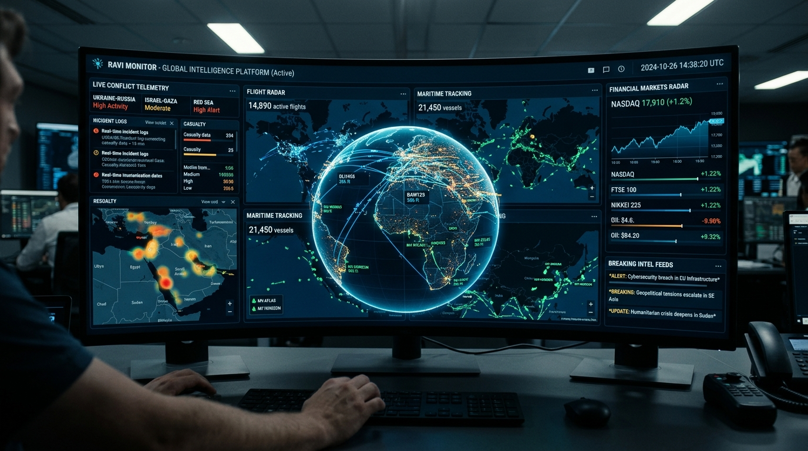

# RAVI MONITOR

**Global Intelligence & Signal Workspace** — a downstream, independently branded evolution of the World Monitor codebase for real-time situational awareness, signal correlation, geospatial intelligence, and operational monitoring.

> This repository is a downstream derivative. The upstream project's applicable license and attribution requirements remain in force. RAVI MONITOR branding identifies the downstream product layer and does not replace upstream copyright notices.

## Product Positioning

RAVI MONITOR brings news, geopolitical signals, infrastructure events, finance indicators, geospatial layers, and intelligence-oriented workflows into a single operator-focused interface. The product is designed for fast scanning, contextual correlation, and extensible data integration.



## What Has Been Enhanced

* **RAVI MONITOR identity** with centralized downstream branding configuration.
* **Premium operator UI** with an obsidian/coffee visual system, tighter hierarchy, responsive surfaces, and clearer information density.
* **Brand isolation** so downstream identity is easier to maintain and rebase against upstream changes.
* **GitHub readiness** with repository hygiene, contribution guidance, ownership/attribution documentation, and review templates.
* **Context-loop engineering workflow** for repeatable audit → implementation → validation → hardening cycles.
* **Preserved upstream architecture** rather than replacing working data, map, API, AI, and deployment subsystems without evidence.

## Core Capabilities

* Real-time global news and intelligence aggregation.
* Geopolitical and infrastructure signal monitoring.
* Interactive geospatial visualization.
* Cross-stream correlation and situational awareness workflows.
* AI-assisted summarization and intelligence processing.
* Finance, energy, disaster, aviation, cyber, and military-oriented data surfaces.
* Extensible API, relay, cache, and deployment layers.

## Technology Foundation

| Layer      | Stack                                               |
| ---------- | --------------------------------------------------- |
| Frontend   | TypeScript, Vite, modern browser APIs               |
| Mapping    | globe.gl, Three.js, deck.gl, MapLibre GL            |
| Desktop    | Tauri 2 / Rust                                      |
| AI         | Ollama and compatible hosted-model integrations     |
| APIs       | Type-safe RPC/API infrastructure and edge functions |
| Caching    | Redis-compatible caching, CDN, service worker       |
| Deployment | Vercel, Docker, relay services, desktop packaging   |

## Quick Start

```bash
git clone https://github.com/Hellthefox808/World-System-monitor.git
cd worldmonitor-main
npm ci
npm run dev
```

The application uses the existing project environment contract. Copy `.env.example` or `.env.local.example` as appropriate for the features you intend to enable.

## Engineering Context Loop

Use:

`RAVI_MONITOR_MAX_CONTEXT_LOOP_PHASE_PROMPT.md`

Required sequence:

```text
Discover
  → Map
  → Establish ownership boundaries
  → Design
  → Implement
  → Validate
  → Debug
  → Harden
  → Synchronize
  → Package
  → Report
```

No validation result should be reported unless the corresponding command actually ran.

## Ownership & Attribution

RAVI MONITOR is maintained as a downstream product identity. Applicable upstream notices, licensing terms, and attribution requirements remain intact.

See:

* `OWNERSHIP.md`
* `LICENSE`
* `CONTRIBUTING.md`
* `SECURITY.md`

## GitHub Publishing

```text
Owner: Hellthefox808
Product: RAVI MONITOR
Repository: https://github.com/Hellthefox808/World-System-monitor.git
```

Do not push the project into an unrelated existing repository.

## Development Quality Gate

```bash
npm ci
npm run typecheck
npm run lint
npm run test
npm run build:full
```

CI remains the final source of truth for release and branch status.

## License

The source code remains subject to the upstream project's applicable **AGPL-3.0-only** licensing terms and accompanying notices. Downstream branding does not alter those obligations.

## Downstream Maintainer

**Ravi Ranjan Singh**  
GitHub: [@Hellthefox808](https://github.com/Hellthefox808)

RAVI MONITOR is the downstream product identity used for this customized distribution.
